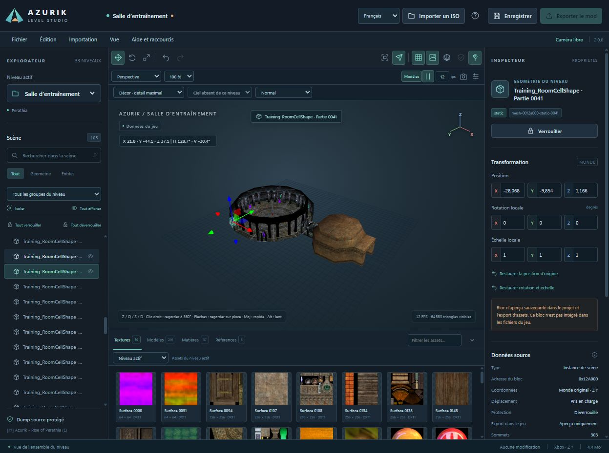
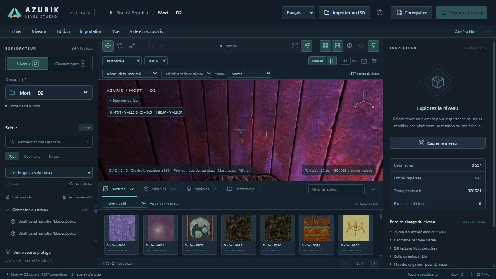
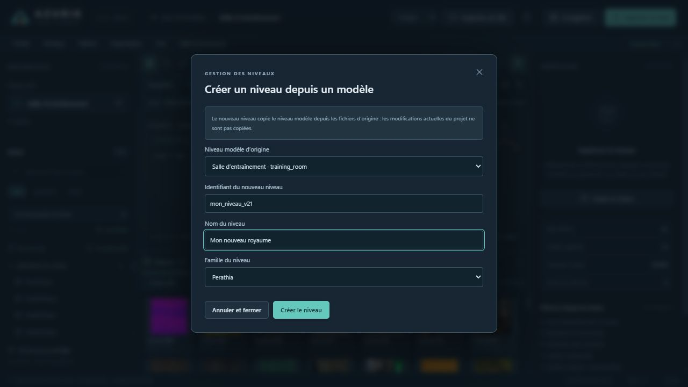
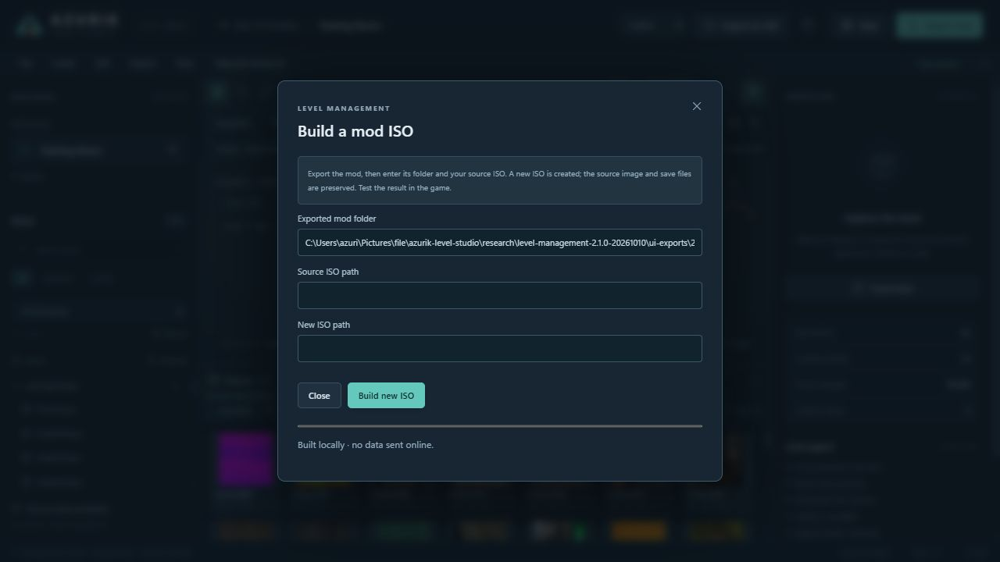

# Azurik Level Studio 2.1.1

**Version 2.1.1** of the Azurik level editor: a local Windows application for viewing and editing levels from your own copy of **Azurik: Rise of Perathia** on the original Xbox.

[Windows download](https://github.com/Azurik-Modding-Hub/Azurik-Level-Editor/releases/tag/v2.1.1) · [French guide](README.fr.md) · [Level management and ISO guide](docs/LEVELS_V21.md) · [Screenshots](docs/SCREENSHOTS.md) · [Roadmap](ROADMAP.md)



## Patch 2.1.1

- **Separate browsing:** the Explorer has distinct **Levels** and **Cinematics** sections. The inspected European dump contains **24 levels and 9 cinematics**, with independent selectors and counts. Each section remembers its last selection; opening or restoring an entry selects its matching section. Level management and source-template selection show gameplay levels.
- **D2 lighting:** directional lights now use the native matrix-to-quaternion conversion under non-uniform scene transforms, correcting the incorrectly dark surfaces. The quaternion remains unnormalised; only the final light direction is normalised, as in the game's shader.
- **D2 interior view:** the initial view opens inside the mauve cavity shell. D2 does not declare a dedicated sky pass: its apparent sky is level scenery. The source green outer cube enclosure is preserved and can appear in exterior views.
- **Language switching:** custom level names remain unchanged in the selector and viewport header.



This is an editor capture. It illustrates decoded source rendering and catalogue separation; it does not certify gameplay in Xemu. [Screenshot captions](docs/SCREENSHOTS.md#version-211--d2-and-separate-catalogue).

## New in 2.1.0

- **Levels menu:** create a registered native level from a clean source template, remove a level from the mod, or restore a removed level. Creation copies the original geometry, collision and scripts; current project edits are not copied. This is not an empty-level compiler.
- **Compatible entry redirection:** replace an original level with a retained clone of the same template, preserving its existing entry-point identities. The selector and training room remain protected.
- **Global history:** Ctrl Z and Ctrl Shift Z undo/redo one action in order across level management, transforms and asset edits. Saved history remains available after reopening the project.
- **Native export:** new XBRs, the updated `gamedata/index/index.xbr` registry and an explicit `iso-plan.json` describe additions, replacements and removals.
- **Build a mod ISO:** select the exported folder, the matching source ISO and a new output path. The builder updates the native `prefetch-lists.txt` dependencies, rebuilds the disc directories and verifies the resulting files without changing the source disc or Xbox executable.

**Validation status:** structural checks, synthetic archive/disc tests and isolated file verification are available. Loading the new levels, portals and inherited quest state in **Xemu still needs runtime testing**. Scripts, collisions and native IDs remain inherited from the template. [Workflow and limits](docs/LEVELS_V21.md).





These captures show the editor forms in an isolated test project; they do not show gameplay validation.

## Patch 2.0.1

Unchanged lighting, reflection transforms and transparent bounds are cached without reducing scene detail or textures. A local A5 material-update benchmark fell from **4.19 to 1.16 ms per frame** (about 72% less CPU time); this does not measure GPU FPS. Stationary texture refreshes are now labelled separately from FPS during camera movement. Existing project and game data are preserved.

## New in 2.0.0

- **Camera controls fixed:** free camera by default, recovered viewport focus, right-drag and arrow-key looking from the same position, with slow/normal/fast movement.
- **Visible menus:** File, Edit, Import, View and Help show named actions and keyboard shortcuts.
- **Reversible level restoration:** restore the active level to its original source state as one undoable action, including asset edits. Other levels and source files remain intact.
- **Ctrl Z / Ctrl Shift Z:** undo and redo transforms, imports, replacements, duplication and restoration. Ctrl Y remains an alias.
- **Static model import/replacement:** OBJ, geometry JSON and glTF/GLB. Compatible existing geometry can be replaced in game exports; new geometry and duplicates are clearly labelled project previews.
- **Model duplication:** independent editable project instances, preserved on save and in the separate preview-asset export.
- **PNG texture import/replacement:** assign textures to imported models, or replace supported native level surfaces with matching dimensions and mipmaps.
- **Performance:** cached static transfers and less repeated viewport work; decoding large levels still takes time.
- **Perathia Modding Hub artwork** supplied by the owner as the executable/window icon, with Windows version metadata updated to 2.0.0.

See the [V2 editing guide](docs/EDITING_V2.md) for compatibility rules and preview export limits.

## Testing modified game files

EDIT : You need to clear the cache for the changes you make to take effect ! Don’t worry, this won’t affect your save files in any way!

This refers **only to Xbox game cache partitions**. Use **Clear Cache** in xemu-dashboard or **Flush Cache Partitions** in LithiumX, then restart with the modified disc. Keep the virtual hard drive and the E partition containing game saves. [Instructions and Xemu references](docs/GAME_CACHE.md).

## Run on Windows

1. Download **Azurik-Level-Studio-2.1.1-Windows-x64.zip** from the release and extract it.
2. Double-click **Azurik Level Studio.exe**. This real Windows executable includes Python and the application dependencies; no Python installation is necessary.
3. Click **Import ISO / Importer un ISO**, select your local Azurik Xbox `.iso` or `.xiso`, and wait for extraction. You can also enter its local path.
4. Choose **Levels** or **Cinematics** in the Explorer, then select an entry. For editing, select an object, unlock it when necessary, then use the transform tools or precise inspector fields.
5. **Save** preserves your project. **Export mod** creates new XBR copies, a registry update when needed, an ISO plan and a report. **Levels → Build a mod ISO**, also offered after export, creates a separate test disc from that export and your matching source ISO.

The repository contains the executable at `windows/Azurik Level Studio.exe`. **Ouvrir Azurik Level Studio.bat** is an optional launcher; `.cmd` and PowerShell launchers are included too. The application opens its own desktop window and uses Microsoft Edge WebView2 for the viewport. Windows x64, .NET Framework and the [WebView2 Runtime](https://developer.microsoft.com/microsoft-edge/webview2/) are required. WebView2 is normally already installed on recent Windows systems.

Projects, imports, caches, exports and logs for the executable live in **`%LOCALAPPDATA%\AzurikLevelStudio`**, separate from bundled application files. The launcher reuses an Azurik server only when its version matches. An older editor is left running and a free local port is selected. It stops only its own server. No console window is required.

Back up an existing project before upgrading. Asset editing uses project format 2; level management uses format 3. The editor loads existing format 1 and 2 projects. Close older editor windows before editing the same project.

## Included explorer and editing features

- **3D explorer:** scenery, placed models, sky variants, textures, materials, source normals and placement hierarchy. Static LEVL terrain includes mountains, cliffs and structures.
- **Separate level and cinematic catalogues:** 24 levels and 9 cinematics in the inspected European dump; availability and counts follow your own disc and project.
- **French / English interface:** switch without reloading the level; labels, messages, numbers and units update. Original resource names retain their identities.
- **Camera navigation:** orbit, perspective/top/front/side views, framing, free movement, fixed-position looking and speed presets.
- **Editing:** move, rotate, scale, precise fields, world/local gizmos where supported, restore original placement, undo/redo, saved projects and mod export.
- **Persistent locks:** individual or whole-level protection, including linked parts and affected descendants, enforced by the backend.
- **Asset browser:** search textures, models, materials and references; inspect sequences and cubemap faces; export a sorted PNG/glTF catalogue using the included asset exporter.
- **Local ISO import:** bounded XDVDFS validation and Azurik identity checks, streaming progress, isolated projects and reopening previous imports.
- **Native level management and ISO construction:** clean template clones, compatible entry aliases, reversible removal and a separate verified output disc.
- **PNG viewport captures** saved in the project with preview and download.
- **Bundled Windows executable**, original application icon, version metadata and SHA-256 checksum. No retail archives or disc images included.

## Controls

| Action | Control |
| --- | --- |
| Orbit / zoom | Left drag / mouse wheel |
| Frame selection / level | F / Home |
| Forward / left / backward / right | French **Z / Q / S / D**; English **W / Q / S / D** |
| Look around without moving | Right drag or arrow keys in free camera |
| Up / down | Space / Ctrl |
| Speed | Slow / Normal / Fast; Shift accelerates, Alt slows |
| Move / rotate / scale | W / E / R when free camera is not consuming the keys |
| Undo / redo / save | Ctrl Z / Ctrl Shift Z (or Ctrl Y) / Ctrl S |
| Deselect | Escape |

Focus the viewport before navigating. Keys follow their letter labels, including AZERTY. Text fields, dialogs and active gizmos suspend navigation; losing focus clears held keys. English **WQSD** is intentional. Language selection translates the editor interface, not the game's dialogue.

## Export behavior and current limits

Source archives and input images are read-only. Placements with verified serialized bindings are written to **new XBR copies**, with original/output checksums and changed-byte reports. Other decoded blocks use clearly marked **preview-only overrides**. These are saved separately in `scene-overrides.json`, not silently applied to the game. Game edits and preview edits have separate counts.

**Visual transforms do not move collision geometry.** Check collisions and gameplay in your test copy. Version 2.1.0 can build a separate ISO from an exported mod and the matching original image. The build report verifies disc structure and file bytes; it deliberately records `imageTestedInGame: false`. Successful construction does not certify gameplay.

A created level inherits its template's geometry, collisions, scripts, portal/spawn IDs and quest-state links. Its displayed family is a catalogue label. Creating a level does not create a new portal or campaign entry automatically. To test it through an existing entry, remove its original level from the mod and select a clone of that same template as the replacement. Cross-template entry remapping and authoring arbitrary empty levels are not supported. [Level guide](docs/LEVELS_V21.md).

The renderer reads game data without running the complete Xbox engine. Characters appear in bind pose. Scripts, skeletal animation, particles, point/spot lighting and some generated texture coordinates remain partial. Skies and the verified A5 two-layer fog/reflection path are supported, with explicit day/night previews. A pixel-identical gameplay render is not claimed. [Screenshot captions](docs/SCREENSHOTS.md) distinguish editor views from gameplay validation.

## Source use and compilation

Python 3.10+ and Pillow are required for source use. To open the native window:

```sh
python -m pip install -r requirements-desktop.txt
python desktop.py
```

Supply a dump containing `gamedata/*.xbr` with `python desktop.py --source "/path/to/Azurik dump"`. `AZURIK_SOURCE` sets the default; a saved default project's source is reused. Source-mode data stays beside the source files. Use `--port 8770` for another port.

The optional browser mode uses `requirements.txt` and `python server.py --open`. The server binds only to `127.0.0.1`. Application modules and Three.js are local; game data is not sent to an external service. [ISO details](docs/ISO_IMPORT.md).

On Windows x64 with Python 3.11+, run **Build Windows.ps1** to compile the executable. It installs `requirements-build.txt`, runs `desktop.spec`, then writes the binary and checksums into `windows/`. The build excludes projects, imports, exports and game data. [Windows build guide](docs/WINDOWS.md).

For sorted assets, run `python export_assets.py --help`. Keep glTF files with their `.bin` and texture folders. This exports existing resources. The 2.0.0 import/replacement tools are described in the [editing guide](docs/EDITING_V2.md); arbitrary native allocation remains in the [roadmap](ROADMAP.md).

## Tests and project links

```sh
python -m pytest -q
```

Node.js is required for frontend regression tests, not for running the application. Tests cover parsing, transforms/pivots, normals/lighting, asset export, navigation, localization, ISO import isolation, locks, undo/redo, guarded exports, desktop process ownership and frozen data/resource paths. Disc fixtures are synthetic. Optional real-dump checks use `AZURIK_GAME_DUMP` and skip when unavailable.

Version 2.1.1 validation on 10 October 2026: **766 passed, 3 skipped** in 70.69 seconds. These automated checks do not certify gameplay in Xemu.

The editor also lives at `tools/level_studio` in the [Expensions repository](https://github.com/Azurik-Modding-Hub/Elemental_Games_Modding---Expensions), alongside the randomizer. The English contribution is [upstream PR #2](https://github.com/JTCPP/Elemental_Games_Modding/pull/2).

Editor source: [MIT license](LICENSE). Dependencies: [third-party notices](THIRD_PARTY_NOTICES.md). Game archives, disc images, extracted assets, saves and user projects are excluded from releases. Illustrations were supplied by the project owner.
