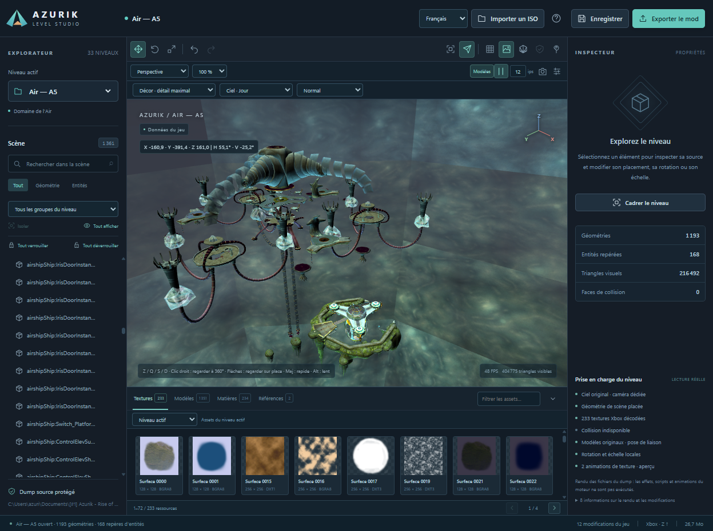

# Azurik Level Studio 1.0.0

**The first official release** of the Azurik level editor: a local Windows application for viewing and editing levels from your own copy of **Azurik: Rise of Perathia** on the original Xbox.

[Windows download](https://github.com/AzurikPerathia/Azurik-Level-Editor/releases/tag/v1.0.0) · [French guide](README.fr.md) · [Screenshots](docs/SCREENSHOTS.md) · [Next version](ROADMAP.md)



## Run on Windows

1. Download **Azurik-Level-Studio-1.0.0-Windows-x64.zip** from the release and extract it.
2. Double-click **Azurik Level Studio.exe**. This real Windows executable includes Python and the application dependencies; no Python installation is necessary.
3. Click **Import ISO / Importer un ISO**, select your local Azurik Xbox `.iso` or `.xiso`, and wait for extraction. You can also enter its local path.
4. Choose a level, select an object, unlock it when necessary, then use the transform tools or precise inspector fields.
5. **Save** preserves your project. **Export mod** creates new XBR copies and a report. Read the report before integrating these into a copy of your game.

The repository contains the executable at `windows/Azurik Level Studio.exe`. **Ouvrir Azurik Level Studio.bat** is an optional launcher; `.cmd` and PowerShell launchers are included too. The application opens its own desktop window and uses Microsoft Edge WebView2 for the viewport. Windows x64, .NET Framework and the [WebView2 Runtime](https://developer.microsoft.com/microsoft-edge/webview2/) are required. WebView2 is normally already installed on recent Windows systems.

Projects, imports, caches, exports and logs for the executable live in **`%LOCALAPPDATA%\AzurikLevelStudio`**, separate from bundled application files. The launcher reuses an existing Azurik server on port 8766, preserving its project; it stops only a server it started itself. No console window is required.

## Features in 1.0.0

- **3D explorer:** scenery, placed models, sky variants, textures, materials, source normals and placement hierarchy. Static LEVL terrain includes mountains, cliffs and structures.
- **33 detected levels** in the inspected European dump; availability follows your own disc's files.
- **French / English interface:** switch without reloading the level; labels, messages, numbers and units update. Original resource names retain their identities.
- **Camera navigation:** orbit, perspective/top/front/side views, framing, free movement, fixed-position looking and speed presets.
- **Editing:** move, rotate, scale, precise fields, world/local gizmos where supported, restore original placement, undo/redo, saved projects and mod export.
- **Persistent locks:** individual or whole-level protection, including linked parts and affected descendants, enforced by the backend.
- **Asset browser:** search textures, models, materials and references; inspect sequences and cubemap faces; export a sorted PNG/glTF catalogue using the included asset exporter.
- **Local ISO import:** bounded XDVDFS validation and Azurik identity checks, streaming progress, isolated projects and reopening previous imports.
- **PNG viewport captures** saved in the project with preview and download.
- **Bundled Windows executable**, original application icon, version metadata and SHA-256 checksum. No retail archives or disc images included.

## Controls

| Action | Control |
| --- | --- |
| Orbit / zoom | Left drag / mouse wheel |
| Frame selection / level | F / Home |
| Forward / left / backward / right | French **Z / Q / S / D**; English **W / Q / S / D** |
| Look around without moving | Right drag or arrow keys in free camera |
| Up / down | Space / Ctrl |
| Speed | Slow / Normal / Fast; Shift accelerates, Alt slows |
| Move / rotate / scale | W / E / R when free camera is not consuming the keys |
| Undo / redo / save | Ctrl Z / Ctrl Y / Ctrl S |
| Deselect | Escape |

Focus the viewport before navigating. Keys follow their letter labels, including AZERTY. Text fields, dialogs and active gizmos suspend navigation; losing focus clears held keys. English **WQSD** is intentional. Language selection translates the editor interface, not the game's dialogue.

## Export behavior and current limits

Source archives and input images are read-only. Placements with verified serialized bindings are written to **new XBR copies**, with original/output checksums and changed-byte reports. Other decoded blocks use clearly marked **preview-only overrides**. These are saved separately in `scene-overrides.json`, not silently applied to the game. Game edits and preview edits have separate counts.

**Visual transforms do not move collision geometry.** Check collisions and gameplay in your test copy. The editor exports modified archives; automatic complete ISO rebuilding is not a feature of 1.0.0.

The renderer reads game data without running the complete Xbox engine. Characters appear in bind pose. Scripts, skeletal animation, particles, point/spot lighting and some generated texture coordinates remain partial. Skies and the verified A5 two-layer fog/reflection path are supported, with explicit day/night previews. A pixel-identical gameplay render is not claimed. [Screenshot captions](docs/SCREENSHOTS.md) distinguish editor views from gameplay validation.

## Source use and compilation

Python 3.10+ and Pillow are required for source use. To open the native window:

```sh
python -m pip install -r requirements-desktop.txt
python desktop.py
```

Supply a dump containing `gamedata/*.xbr` with `python desktop.py --source "/path/to/Azurik dump"`. `AZURIK_SOURCE` sets the default; a saved default project's source is reused. Source-mode data stays beside the source files. Use `--port 8770` for another port.

The optional browser mode uses `requirements.txt` and `python server.py --open`. The server binds only to `127.0.0.1`. Application modules and Three.js are local; game data is not sent to an external service. [ISO details](docs/ISO_IMPORT.md).

On Windows x64 with Python 3.11+, run **Build Windows.ps1** to compile the executable. It installs `requirements-build.txt`, runs `desktop.spec`, then writes the binary and checksums into `windows/`. The build excludes projects, imports, exports and game data. [Windows build guide](docs/WINDOWS.md).

For sorted assets, run `python export_assets.py --help`. Keep glTF files with their `.bin` and texture folders. This exports existing resources; model/texture import and replacement are planned for the [next version](ROADMAP.md).

## Tests and project links

```sh
python -m pytest -q
```

Node.js is required for frontend regression tests, not for running the application. Tests cover parsing, transforms/pivots, normals/lighting, asset export, navigation, localization, ISO import isolation, locks, undo/redo, guarded exports, desktop process ownership and frozen data/resource paths. Disc fixtures are synthetic. Optional real-dump checks use `AZURIK_GAME_DUMP` and skip when unavailable.

The editor also lives at `tools/level_studio` in the [Expensions repository](https://github.com/AzurikPerathia/Elemental_Games_Modding---Expensions), alongside the randomizer. The English contribution is [upstream PR #2](https://github.com/JTCPP/Elemental_Games_Modding/pull/2).

Editor source: [MIT license](LICENSE). Dependencies: [third-party notices](THIRD_PARTY_NOTICES.md). Game archives, disc images, extracted assets, saves and user projects are excluded from releases. Illustrations were supplied by the project owner.
