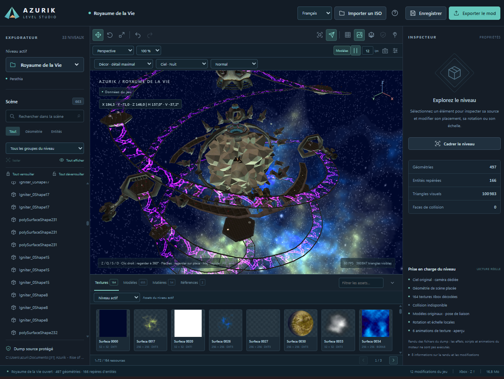

# Azurik Level Studio 1.0.0

**Première version officielle** de l’éditeur de niveaux d’**Azurik: Rise of Perathia**, pour votre propre copie du jeu Xbox.

[Télécharger pour Windows](https://github.com/AzurikPerathia/Azurik-Level-Editor/releases/tag/v1.0.0) · [English guide](README.en.md) · [Illustrations](docs/SCREENSHOTS.md) · [Prochaine version](ROADMAP.md)

## Ouvrir le logiciel

1. Téléchargez **Azurik-Level-Studio-1.0.0-Windows-x64.zip** et extrayez-le.
2. Double-cliquez sur **Azurik Level Studio.exe**. L’exécutable inclut Python et les dépendances : aucune installation de Python n’est nécessaire.
3. Cliquez sur **Importer un ISO**, choisissez votre ISO/XISO Xbox d’Azurik ou saisissez son chemin. Attendez l’import, puis choisissez le niveau.
4. Sélectionnez un élément, déverrouillez-le si nécessaire, puis déplacez-le, tournez-le ou changez son échelle avec les outils ou les champs précis.
5. **Enregistrer** conserve le projet. **Exporter le mod** crée de nouveaux XBR avec un rapport, à intégrer dans une copie du jeu pour tester.

Dans les sources, l’exécutable est dans `windows/Azurik Level Studio.exe`. **Ouvrir Azurik Level Studio.bat** permet aussi de le lancer ; les lanceurs `.cmd` et PowerShell sont conservés. Le logiciel ouvre sa propre fenêtre. Windows x64, .NET Framework et le [runtime WebView2](https://developer.microsoft.com/microsoft-edge/webview2/) sont requis ; ce dernier est généralement installé.

La version compilée conserve projets, imports, cache, exports et journaux dans **`%LOCALAPPDATA%\AzurikLevelStudio`**. Elle réutilise un éditeur déjà ouvert sur le port 8766 avec son projet. En mode source, les données restent dans le dossier du code.

## Fonctionnalités

- Décors, modèles placés, textures, matières et références en 3D ; montagnes et structures statiques ; ciel jour/nuit.
- 33 niveaux détectés dans le dump européen étudié ; la disponibilité suit votre disque.
- Interface français/anglais sans rechargement du niveau.
- Caméra orbitale ou libre, vues perspective/dessus/face/côté, cadrage et regard à 360° sur place.
- Déplacement, rotation, échelle, champs précis, annuler/rétablir et restauration du placement source.
- Verrouillage individuel ou du niveau, enregistré et contrôlé par le serveur.
- Bibliothèque d’assets avec recherche, séquences et cubemaps ; export trié PNG/glTF avec l’outil fourni.
- Import ISO local, progression, validation et projets séparés.
- Captures PNG de la vue enregistrées dans le projet.
- Véritable exécutable Windows, icône, version et empreinte SHA-256.

## Commandes

| Action | Commande |
| --- | --- |
| Orbiter / zoomer | Clic gauche + glisser / molette |
| Cadrer la sélection / le niveau | F / Home |
| Avancer / gauche / reculer / droite | **Z / Q / S / D** en français ; **W / Q / S / D** en anglais |
| Regarder sans se déplacer | Clic droit + glisser ou flèches en caméra libre |
| Monter / descendre | Espace / Ctrl |
| Vitesse | Lent / Normal / Rapide ; Maj accélère, Alt ralentit |
| Déplacer / tourner / redimensionner | W / E / R hors touches consommées par la caméra |
| Annuler / rétablir / enregistrer | Ctrl Z / Ctrl Y / Ctrl S |

Cliquez dans la vue avant de naviguer. Les lettres suivent le clavier, y compris AZERTY. Les champs de texte et dialogues suspendent les déplacements. La langue traduit l’interface ; les noms des ressources restent conservés.

## Export et limites

Le dump et l’ISO d’origine sont lus sans modification. Les placements vérifiés sont exportés dans de **nouveaux XBR** avec empreintes et rapport. Les autres transformations sont signalées **aperçu seulement**, enregistrées séparément dans `scene-overrides.json` et ne sont pas appliquées au jeu.

Les collisions restent à leur position originale quand un décor est déplacé : vérifiez le résultat en jeu. La reconstruction automatique d’une ISO complète n’est pas une fonction de l’éditeur 1.0.0.

Le rendu utilise les données du jeu sans exécuter tout le moteur Xbox. Personnages en pose de liaison, scripts, animations de squelette, particules, éclairages ponctuels et certains effets restent partiels. Ciel et chemin vérifié du brouillard/reflet à deux couches d’A5 sont pris en charge. Un rendu identique pixel par pixel n’est pas annoncé.

## Sources et prochaine version

Pour la fenêtre native : Python 3.10+, `python -m pip install -r requirements-desktop.txt`, puis `python desktop.py`. Utilisez `--source` pour un dump extrait. Le navigateur reste disponible avec `python server.py --open` après installation de `requirements.txt`.

Pour compiler : Windows x64, Python 3.11+ et **Build Windows.ps1**. Tests : `python -m pytest -q` ; Node.js est requis uniquement pour les tests de l’interface. Les fichiers du jeu ne sont pas inclus.

La prochaine version vise l’import, le remplacement et la duplication de modèles, ainsi que l’import et le remplacement de textures. Ces fonctions sont **prévues** et ne sont pas disponibles dans la 1.0.0. Voir [ROADMAP.md](ROADMAP.md).

[Dépôt dédié](https://github.com/AzurikPerathia/Azurik-Level-Editor) · [Expensions](https://github.com/AzurikPerathia/Elemental_Games_Modding---Expensions) · [Pull request en anglais](https://github.com/JTCPP/Elemental_Games_Modding/pull/2)
