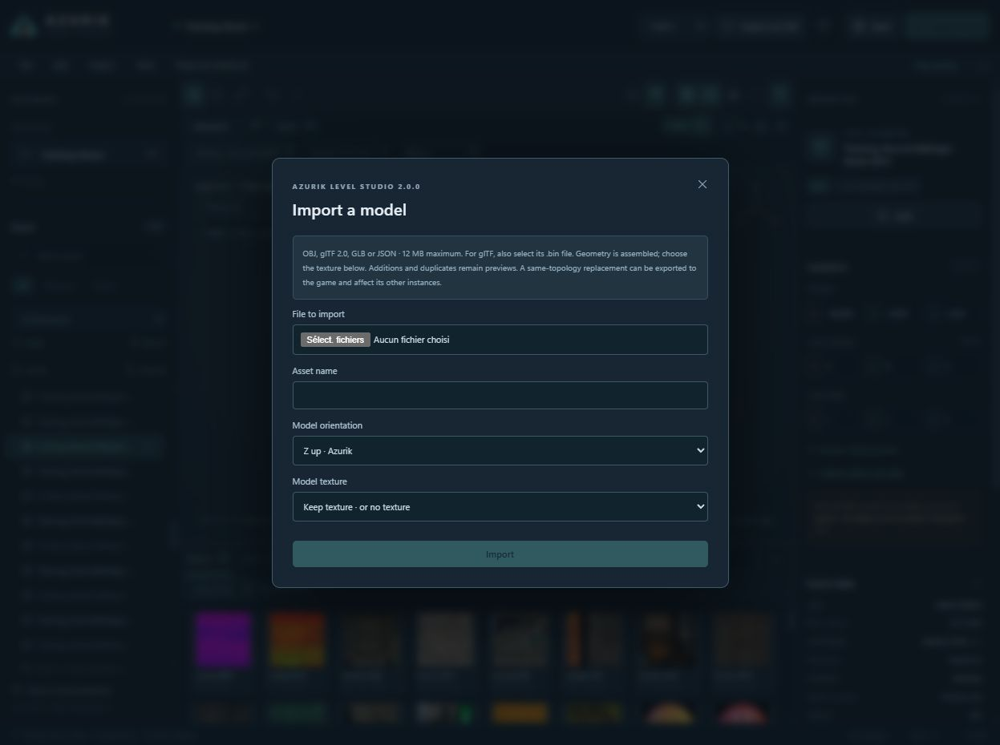
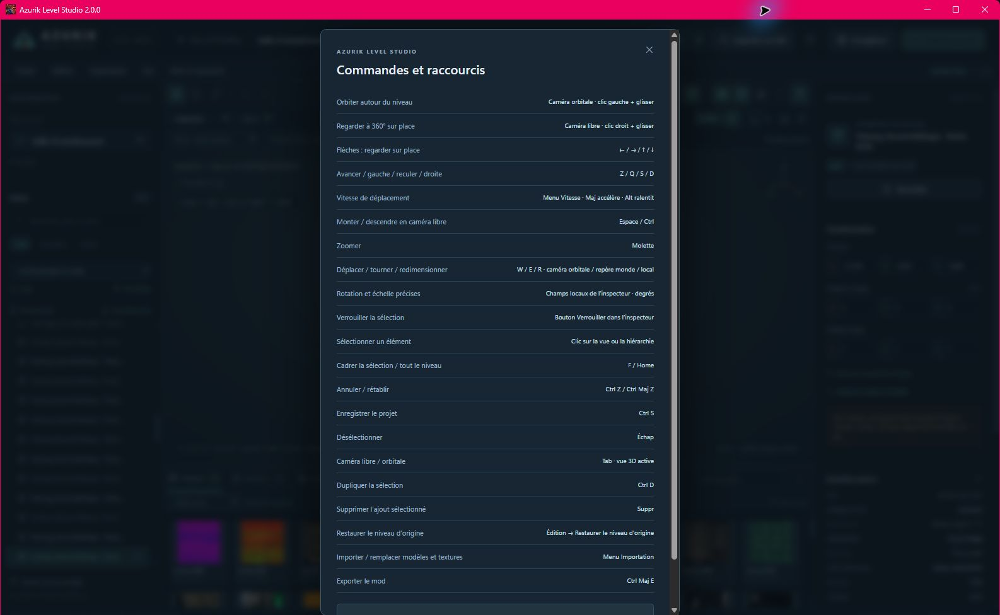
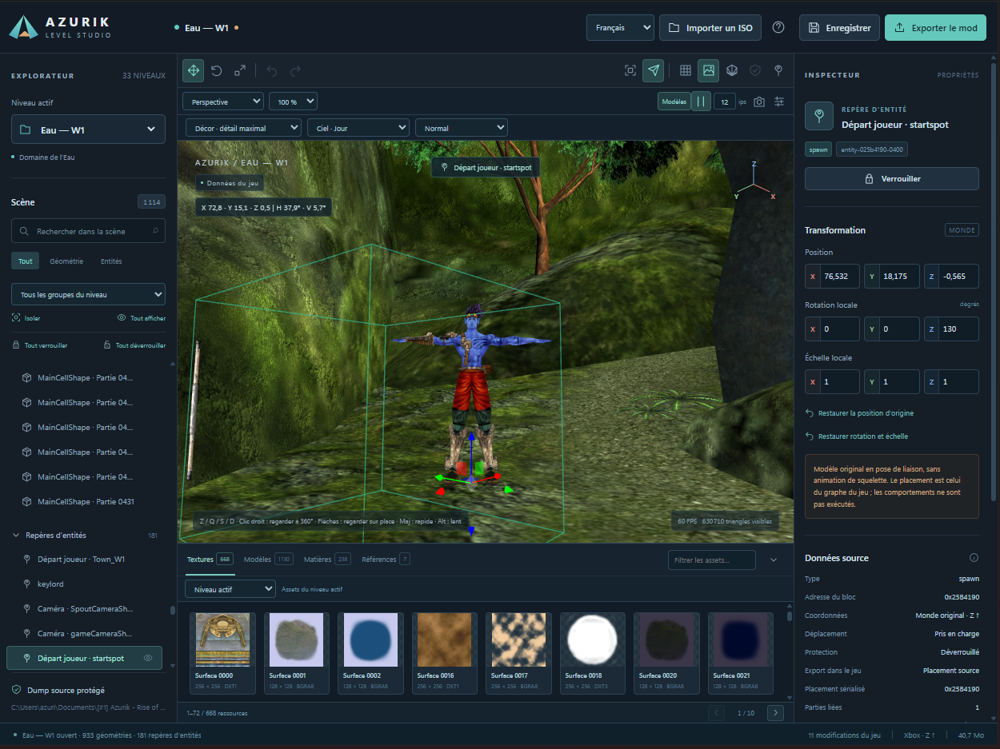
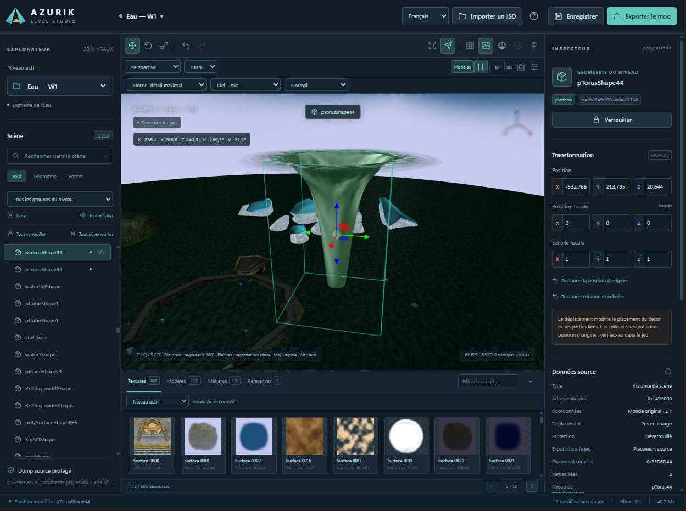

# Screenshots — Azurik Level Studio

## Version 2.1.1 — D2 and separate catalogue

Captured in the 2.1.1 editor while inspecting D2. The Explorer shows separate Levels and Cinematics sections: the inspected European dump has 24 levels and 9 cinematics. Project-created entries change these counts.

D2 opens inside the mauve cavity shell, which is level scenery. Its native level record does not declare a dedicated sky pass. Directional lights now use the game's matrix-to-quaternion conversion under non-uniform scene transforms: the quaternion is not normalised, and only the final shader light direction is normalised. The source green outer cube enclosure is preserved and may appear in exterior views.

This capture shows decoded game data in the editor, not a modified disc running in Xemu. It does not establish pixel-identical rendering or validate gameplay.

**Français :** capture de D2 dans l’éditeur 2.1.1, avec sections Niveaux et Cinématiques séparées. Le dump européen étudié contient 24 niveaux et 9 cinématiques ; les ajouts du projet modifient ces compteurs. La vue initiale se trouve dans l’enveloppe mauve de la cavité, qui appartient au décor ; D2 ne déclare pas de passe de ciel dédiée. Les lumières utilisent la conversion native de matrice en quaternion sous une échelle non uniforme : le quaternion n’est pas normalisé, seule la direction finale dans le shader l’est. L’enveloppe cubique extérieure verte source est conservée. Cette illustration ne montre pas une ISO testée dans Xemu.

## Version 2.0.0 — menus and model import

Captured in the 2.0.0 editor during interface validation. The Training room does not contain a sky resource. These show the application interface, not gameplay validation.

## Version 1.0.0 — owner-supplied level views

These four screenshots were supplied by the project owner on 9 October 2026. They show editor views of decoded game data, not a rebuilt disc tested in Xemu. A gameplay comparison can be added when supplied.

## Water W1 — player spawn

Player spawn, character in bind pose, move gizmo, precise inspector and texture browser.

## Water W1 — edited structure

A moved structure with its bounds and placement fields. Collision placement is unchanged.

## Air A5 — level overview

Placed structures and sky/fog preview with original source textures.

## Realm of Life — night sky

Realm layout, night-sky preview and texture browser.

## Version 2.1.0 — level management

The following captures show the running 2.1.0 editor with an isolated test project. They illustrate its actual creation and ISO construction dialogs. They do not show gameplay or certify a new level's behaviour in Xemu.

